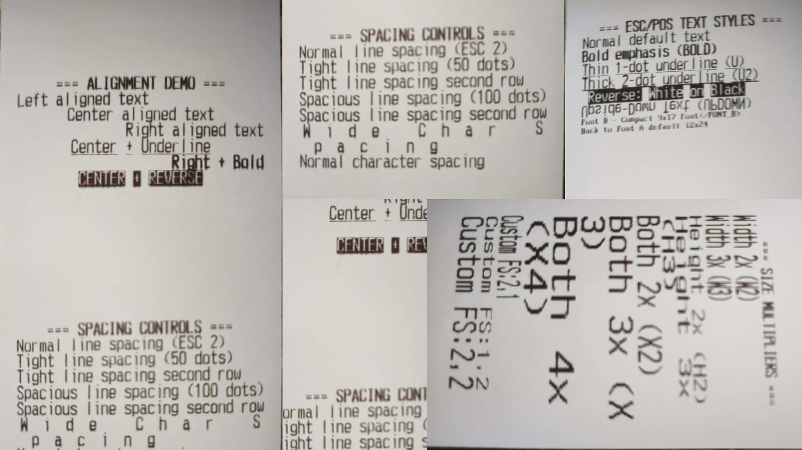

# react-native-earl-thermal-printer


A modern, high-performance thermal printer library for React Native. Built with the **New Architecture (TurboModules)** for synchronous communication, zero legacy bridge overhead, Floyd-Steinberg photo dithering, native hardware barcodes, and Android 12+ Bluetooth compliance.

Supports **USB**, **Bluetooth (BLE)**, and **Network (TCP/IP)** receipt & label printers across Android and iOS.

---

<!-- 📸 PLACEHOLDER: Main Hero Printed Samples Banner -->
<div align="center">
  
  <p><em>Real-world thermal receipts, product labels, dispatch tickets, hardware barcodes, and dithered logos printed with react-native-earl-thermal-printer.</em></p>
</div>

---

## Requirements

| Platform     | Minimum Version    |
| ------------ | ------------------ |
| React Native | >= 0.73            |
| React        | >= 18              |
| Android SDK  | 23 (compileSdk 34) |
| iOS          | 13.4+              |

## Installation

```bash
npm install react-native-earl-thermal-printer
# or
yarn add react-native-earl-thermal-printer
```

### iOS Setup

```bash
cd ios && pod install
```

Add Bluetooth and Local Network permission descriptions to your `ios/PodTest/Info.plist` (or your app's `Info.plist`):

```xml
<key>NSBluetoothAlwaysUsageDescription</key>
<string>This app requires Bluetooth access to connect to thermal receipt and label printers.</string>
<key>NSLocalNetworkUsageDescription</key>
<string>This app requires local network access to discover and connect to network printers.</string>
```

### Android Setup

Add the required Bluetooth permissions to your `android/app/src/main/AndroidManifest.xml`:

```xml
<!-- Android 12+ (API 31+) -->
<uses-permission android:name="android.permission.BLUETOOTH_SCAN" android:usesPermissionFlags="neverForLocation" />
<uses-permission android:name="android.permission.BLUETOOTH_CONNECT" />

<!-- Android 11 and below -->
<uses-permission android:name="android.permission.BLUETOOTH" android:maxSdkVersion="30" />
<uses-permission android:name="android.permission.BLUETOOTH_ADMIN" android:maxSdkVersion="30" />
```

---

## Printer Support Matrix

| Feature | Android | iOS |
| :--- | :---: | :---: |
| **USB Printer** | Yes | No (returns `ERR_UNSUPPORTED`) |
| **BLE Printer** | Yes | Yes |
| **Net Printer (TCP/IP)** | Yes | Yes |
| **ReceiptBuilder (Fluent API)** | Yes | Yes |
| **Thermal Label Printing** | Yes | Yes |
| **Multi-Column Tables** | Yes | Yes |
| **Native 1D Barcodes** | Yes | Yes |
| **Native ESC/POS QR Codes** | Yes | Yes |
| **Floyd-Steinberg Image Dithering** | Yes | Yes |
| **Cash Drawer Kick (Pin 2/5)** | Yes | Yes |
| **Paper Cut / Partial Cut** | Yes | Yes |

---

## 🏷️ Thermal Label & Tag Printing

Print crisp product barcodes, retail shelf price tags, asset labels, and shipping tags using the **`ReceiptBuilder`**:

### 1. Retail Shelf Price Label

```tsx
const shelfTag = new ReceiptBuilder({ paperWidth: 32 })
  .align("center")
  .textLine("ORGANIC WHOLE MILK 1L", { bold: true })
  .textLine("$3.99", { bold: true, size: "3x" })
  .textLine("UNIT: $3.99/L | SKU: 88231")
  .feed(1)
  .barcode("012345678905", { type: "UPC-A", height: 60, position: "below" })
  .cut()
  .build();

await BLEPrinter.printRawData(shelfTag);
```

### 2. Product Barcode & Asset Tag

```tsx
const assetTag = new ReceiptBuilder({ paperWidth: 32 })
  .align("center")
  .textLine("ACME LOGISTICS CORP", { bold: true })
  .textLine("ASSET TAG - DO NOT REMOVE", { invert: true })
  .feed(1)
  .barcode("AST-992384-US", { type: "CODE128", height: 70, width: 2, position: "below" })
  .feed(1)
  .qrCode("https://inventory.acme.com/asset/992384", { size: 6 })
  .textLine("SN: 992384-2026", { font: "B" })
  .cut()
  .build();

await BLEPrinter.printRawData(assetTag);
```

### 3. Shipping & Package Dispatch Label

```tsx
const shippingLabel = new ReceiptBuilder({ paperWidth: 48 }) // 80mm / 3-inch roll
  .align("center")
  .textLine("EXPRESS COURIER DISPATCH", { bold: true, size: "2x" })
  .textLine("PRIORITY OVERNIGHT", { invert: true })
  .divider("=")
  .keyValue("TRACKING #:", "TRK-9876-2026-US")
  .keyValue("SERVICE:", "FedEx Express")
  .keyValue("WEIGHT:", "2.40 kg")
  .divider("-")
  .textLine("SHIP TO:", { bold: true })
  .textLine("Jane Doe - (555) 234-5678")
  .textLine("742 Evergreen Terrace, Springfield, OR")
  .divider("-")
  .barcode("TRK98762026US", { type: "CODE128", height: 80, position: "below" })
  .feed(1)
  .qrCode("https://tracking.carrier.com/TRK98762026US", { size: 6 })
  .cut()
  .build();

await BLEPrinter.printRawData(shippingLabel);
```

### 📸 Printed Label Samples & Templates

<table width="100%">
  <tr>
    <td width="33%" align="center">
      <!-- 📸 PLACEHOLDER: Shelf Price Label -->
      <br/>
      <strong>Retail Shelf Price Tag</strong><br/>
      <em>Large 3x price, unit info & UPC-A barcode</em>
    </td>
    <td width="33%" align="center">
      <!-- 📸 PLACEHOLDER: Product & Asset Label -->
      <br/>
      <strong>Product Barcode & Asset Tag</strong><br/>
      <em>Inverted text badge, Code128 & QR code</em>
    </td>
    <td width="33%" align="center">
      <!-- 📸 PLACEHOLDER: Shipping & Dispatch Label -->
      <br/>
      <strong>Shipping & Dispatch Label</strong><br/>
      <em>Recipient address, priority badge & tracking barcode</em>
    </td>
  </tr>
</table>

---

## 🚀 Fluent `ReceiptBuilder` API

Instead of manually crafting XML or raw hex tags, use the chainable, type-safe **`ReceiptBuilder`**:

```tsx
import { ReceiptBuilder, BLEPrinter } from "react-native-earl-thermal-printer";

// Build a complete receipt layout
const payload = new ReceiptBuilder({ paperWidth: 32 }) // 32 for 58mm, 42/48 for 80mm
  .align("center")
  .textLine("COFFEE SHOP", { bold: true, size: "2x" })
  .textLine("123 Main Street, Suite 100")
  .textLine("Tel: (555) 123-4567")
  .divider("-")
  
  // Multi-column table layout with auto word-wrap
  .table([
    { text: "Item", width: 0.5 },
    { text: "Qty", width: 0.2, align: "center" },
    { text: "Price", width: 0.3, align: "right" },
  ])
  .divider("-")
  .table([
    { text: "Espresso Double", width: 0.5 },
    { text: "1", width: 0.2, align: "center" },
    { text: "$3.50", width: 0.3, align: "right" },
  ])
  .table([
    { text: "Oat Milk Croissant", width: 0.5 },
    { text: "2", width: 0.2, align: "center" },
    { text: "$8.00", width: 0.3, align: "right" },
  ])
  .divider("=")
  
  // Totals & Key-Value rows
  .keyValue("Subtotal:", "$11.50")
  .keyValue("Tax (8%):", "$0.92")
  .textLine("TOTAL: $12.42", { bold: true, size: "2x", align: "right" })
  .feed(1)
  
  // Barcode & QR code
  .barcode("INV-982341", { type: "CODE128", height: 60, position: "below" })
  .feed(1)
  .qrCode("https://coffeeshop.com/receipt/982341", { size: 6 })
  .textLine("Thank you for your visit!", { align: "center" })
  .cut({ partial: false, feed: 3 })
  .build();

// Print immediately to any connected printer
await BLEPrinter.printRawData(payload);
```

### 📸 Printed Receipt Samples & Templates

<table width="100%">
  <tr>
    <td width="33%" align="center">
      <!-- 📸 PLACEHOLDER: Cafe & Restaurant Receipt -->
      <br/>
      <strong>Cafe & Restaurant Receipt</strong><br/>
      <em>3-Column items, totals, barcode & QR</em>
    </td>
    <td width="33%" align="center">
      <!-- 📸 PLACEHOLDER: Warehouse & Dispatch Label -->
      <br/>
      <strong>Warehouse Dispatch Label</strong><br/>
      <em>Inverted text, customer info & Code39</em>
    </td>
    <td width="33%" align="center">
      <!-- 📸 PLACEHOLDER: Kitchen Order Ticket (KOT) -->
      <br/>
      <strong>Kitchen Order Ticket (KOT)</strong><br/>
      <em>3× large headers, notes & partial cut</em>
    </td>
  </tr>
</table>

---

## Multi-Column Table Layouts

Automatic word wrapping and proportional columns for itemized bills on 58mm (32 chars) and 80mm (48 chars):

```tsx
await BLEPrinter.printColumns([
  { text: "Organic Sourdough Bread", width: 0.5, align: "left" },
  { text: "x2", width: 0.2, align: "center" },
  { text: "$12.00", width: 0.3, align: "right" },
], 32);
```

<!-- 📸 PLACEHOLDER: Multi-Column Table Printed Sample -->
<div align="center">
  
  <p><em>Automatic column wrapping on 58mm thermal paper roll.</em></p>
</div>

---

## Native Hardware Barcodes & QR Codes

Generate sharp vector barcodes directly from printer hardware without blurry raster images:

```tsx
// 1D Barcodes: CODE128, CODE39, EAN13, EAN8, UPC-A, UPC-E, ITF, CODABAR
await BLEPrinter.printBarcode("INV-982341", {
  type: "CODE128",
  height: 80,        // Height in dots (1–255)
  width: 2,          // Width multiplier (1–6)
  position: "below", // "none" | "above" | "below" | "both"
});

// 2D Hardware QR Code: Universal ESC/POS GS v 0 Raster Output
await BLEPrinter.printNativeQRCode("https://example.com/order/1029", {
  size: 6,              // Module size in dots (3–10)
  errorCorrection: "M", // "L" (7%), "M" (15%), "Q" (25%), "H" (30%)
});
```

### 💡 Barcode Selection Guide & Thermal Paper Limits

| Barcode Type | Recommended For | 58mm Roll (384 dots) | 80mm Roll (576 dots) | Density & Camera Scannability |
| :--- | :--- | :--- | :--- | :--- |
| **`CODE128`** *(Recommended)* | Tracking numbers, invoices, orders (`TRK-9988`, `INV-042`) | ✅ **Up to 24 chars** | ✅ **Up to 36 chars** | 🚀 **Highest density.** Thick 2-dot bars scan instantly on all phone cameras. |
| **`EAN13` / `UPC-A`** | Retail product barcodes (12–13 digits) | ✅ **12–13 digits** | ✅ **12–13 digits** | 🚀 **Standard retail.** Crisp, high-contrast scanning. |
| **`CODE39`** | Short alphanumeric legacy codes (`BOX-1`, `SKU9`) | ⚠️ **Max 6 chars** | ✅ **Max 10 chars** | ⚠️ **Low density.** Requires 16–19 modules per char. |

> [!WARNING]
> **CODE39 Hardware Limitation on 58mm Thermal Rolls**:
> CODE39 is a legacy 1974 standard that requires 9 wide/narrow elements per character plus start/stop asterisks `*`. On standard 58mm thermal rolls (384 printable dots), strings longer than 6–7 characters physically exceed the paper width, causing printer firmware to output a `"wide error!"` warning. If forced to 1-dot width, thermal heat bleeding can make the thin lines too compact for smartphone cameras.
>
> **Solution**: Use **`CODE128`** for all alphanumeric codes, serial numbers, and tracking IDs. `CODE128` has double the data density, fits easily on 58mm and 80mm paper rolls, and scans reliably in under 0.05 seconds.

<!-- 📸 PLACEHOLDER: Hardware Barcodes & QR Code Printed Sample -->
<div align="center">
  
  <p><em>Direct hardware vector barcodes and ISO/IEC 18004 compliant ESC/POS QR code.</em></p>
</div>

---

## Floyd-Steinberg Photorealistic Image Dithering

All printer modules feature built-in **Floyd-Steinberg error diffusion dithering**, enabling clean photo, shadow, and logo rendering on black-and-white thermal paper:

```tsx
// Remote HTTP/HTTPS image or local file URI (file://...)
await BLEPrinter.printImage("https://example.com/logo.png", 300);
```

<!-- 📸 PLACEHOLDER: Image Dithering Comparison -->
<div align="center">
  
  <p><em>Left: Standard binary threshold (harsh). Right: Floyd-Steinberg error diffusion (smooth gradients & details).</em></p>
</div>

---

## Quick Start

```tsx
import {
  USBPrinter,
  BLEPrinter,
  NetPrinter,
  NetPrinterEventEmitter,
  RN_THERMAL_RECEIPT_PRINTER_EVENTS,
} from "react-native-earl-thermal-printer";
```

### USB Printer (Android only)

```tsx
await USBPrinter.init();
const devices = await USBPrinter.getDeviceList();
await USBPrinter.connectPrinter(devices[0].vendor_id, devices[0].product_id);

await USBPrinter.printText("<C><B>Hello from USB!</B></C>\n");
await USBPrinter.printBarcode("1234567890", { type: "CODE128" });
await USBPrinter.printImage("https://example.com/logo.png", 300);
await USBPrinter.cutPaper();
USBPrinter.closeConn();
```

### BLE Printer

```tsx
await BLEPrinter.init();
const devices = await BLEPrinter.getDeviceList();
await BLEPrinter.connectPrinter(devices[0].inner_mac_address);

await BLEPrinter.printText("<C><B>Hello from BLE!</B></C>\n");
await BLEPrinter.printBill("Receipt line\n");
await BLEPrinter.openCashDrawer(2); // Kick cash drawer pin 2
BLEPrinter.closeConn();
```

### Net Printer (TCP/IP)

```tsx
await NetPrinter.init();

// Listen for network printers discovered via UDP broadcast
NetPrinterEventEmitter.addListener(
  RN_THERMAL_RECEIPT_PRINTER_EVENTS.EVENT_NET_PRINTER_SCANNED_SUCCESS,
  (printers) => console.log("Found printers:", printers)
);

const devices = await NetPrinter.getDeviceList();
await NetPrinter.connectPrinter("192.168.1.100", 9100);
await NetPrinter.printText("Hello from Network Printer!\n");
NetPrinter.closeConn();
```

---

## API Reference

All three printer objects (`USBPrinter`, `BLEPrinter`, `NetPrinter`) provide the following methods:

### Connection Management
* `init(): Promise<string>` — Initialize native module.
* `getDeviceList(): Promise<Device[]>` — Discover paired or connected printers.
* `connectPrinter(...): Promise<Device>` — Connect to device.
* `closeConn(): void` — Safely close connection.

### Printing Methods
* `printText(text: string, opts?: PrinterOptions): Promise<void>` — Print formatted ESC/POS string.
* `printBill(text: string, opts?: PrinterOptions): Promise<void>` — Print with automatic trailing blank lines and paper cut.
* `printImage(imageUrl: string, imageWidth?: number): Promise<void>` — Print image with Floyd-Steinberg dithering from remote URL or `file://`.
* `printQrCode(qrCode: string, qrSize?: number): Promise<void>` — Print 2D QR code.
* `printBarcode(data: string, opts?: BarcodeOptions): Promise<void>` — Print native hardware 1D barcode.
* `printNativeQRCode(data: string, opts?: QRCodeOptions): Promise<void>` — Direct ESC/POS hardware QR code.
* `printColumns(columns: TableColumn[], totalWidth?: number): Promise<void>` — Multi-column formatted table with wrapping.
* `openCashDrawer(pin?: 2 | 5): Promise<void>` — Pulse cash drawer kickout (pin 2 or pin 5).
* `cutPaper(partial?: boolean, feedLines?: number): Promise<void>` — Cut receipt paper.
* `printRawData(base64Data: string): Promise<void>` — Send raw base64-encoded ESC/POS bytes.

---

## Barcode Support

Generate crisp hardware barcodes without relying on slow image rasterization:

```tsx
await BLEPrinter.printBarcode("978020137962", {
  type: "EAN13", // "CODE128" | "CODE39" | "EAN13" | "EAN8" | "UPC-A" | "ITF" | "CODABAR"
  height: 80,    // Height in dots (1–255)
  width: 2,      // Width multiplier (1–6)
  position: "below", // "none" | "above" | "below" | "both"
});
```

---

## ESC/POS Inline Formatting Tags

When using `printText()` or `printBill()`, tags apply formatting per line:

| Tag | Closing Tag | Description |
| :--- | :--- | :--- |
| `<C>` | `</C>` | Center alignment |
| `<R>` | `</R>` | Right alignment |
| `<L>` | `</L>` | Left alignment |
| `<BOLD>` | `</BOLD>` | Bold emphasis |
| `<U>` | `</U>` | 1-dot underline |
| `<U2>` | `</U2>` | 2-dot thick underline |
| `<REV>` | `</REV>` | Reverse white-on-black text |
| `<UPDOWN>` | `</UPDOWN>` | Upside-down text |
| `<FONT_A>` | — | Standard font (12×24) |
| `<FONT_B>` | — | Compact font (9×17) |
| `<W2>` | `</W2>` | 2× width |
| `<H2>` | `</H2>` | 2× height |
| `<X2>` | `</X2>` | 2× width & 2× height |
| `<FS:W,H>` | `</FS>` | Custom font size (e.g. `<FS:3,3>`) |
| `<LINESPC:N>` | `</LINESPC>` | Line spacing in dots (0–255) |
| `<CHARSPC:N>` | `</CHARSPC>` | Character spacing in dots (0–255) |
| `<FEED:N>` | — | Feed N blank lines |
| `<BARCODE:TYPE:DATA>` | — | Embed inline barcode (e.g. `<BARCODE:CODE128:ABC123>`) |
| `<QR:SIZE:DATA>` | — | Embed inline QR code (e.g. `<QR:6:https://example.com>`) |
| `<PARTCUT>` | — | Partial paper cut |
| `<DRAWER>` | — | Pulse cash drawer |

<!-- 📸 PLACEHOLDER: Text Styles & Sizing Strip -->
<div align="center">
  
  <p><em>Demonstration strip of inline formatting tags and sizing presets.</em></p>
</div>

---

## License

ISC © [Ordovez, Earl Romeo](https://github.com/Swif7ify)
